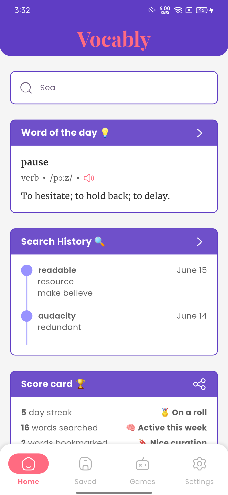

# Vocably

Vocably is an English learning application.

> **Note:** This app is still under active development. Features and functionality may change as development progresses.

## Screenshots



## Features

- **Word Lookup:** Search for English words and view detailed definitions, phonetics, and audio pronunciations.
- **Translations:** Get translations for words in multiple languages.
- **Etymology:** Explore the origins and history of words.
- **Synonyms & Antonyms:** Discover related words to expand your vocabulary.
- **Examples:** See example sentences for better understanding.
- **Search History:** Track your recent searches.
- **Scoreboard:** Visualize your learning streak and activity.
- **Bookmarks:** Save words for future reference.
- **Theming:** Supports light and dark themes.
- **Interactive UI:** Smooth animations and charts for an engaging experience.

## Getting Started

### Prerequisites

- [Flutter SDK](https://flutter.dev/docs/get-started/install)
- [Dart SDK](https://dart.dev/get-dart)
- Android Studio, VS Code, or any preferred IDE

### Installation

1. **Clone the repository:**
   ```sh
   git clone https://github.com/yourusername/vocably.git
   cd vocably
   ```

2. **Install dependencies:**
   ```sh
   flutter pub get
   ```

3. **Run the app:**
   ```sh
   flutter run
   ```

## Project Structure

- `lib/`
  - `main.dart` - App entry point
  - `models/` - Data models (e.g., [`word_entry_dto.dart`](lib/models/word_entry_dto.dart), [`translation_dto.dart`](lib/models/translation_dto.dart))
  - `services/` - API and data services (e.g., [`dictionary_api_service.dart`](lib/services/dictionary_api_service.dart))
  - `themes/` - Theme and color definitions (e.g., [`app_colors.dart`](lib/themes/app_colors.dart))
  - `utils/` - Utility functions (e.g., [`utilities.dart`](lib/utils/utilities.dart))
  - `views/` - Screens and UI components
  - `widgets/` - Reusable widgets


## License

[MIT](LICENSE)

---

*Made with Flutter ❤️*
